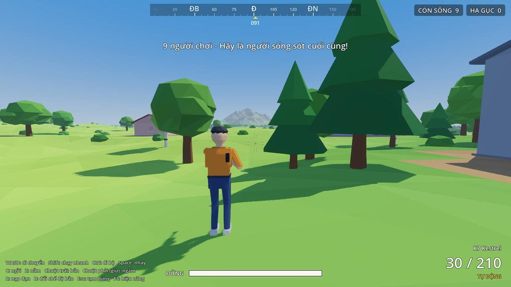
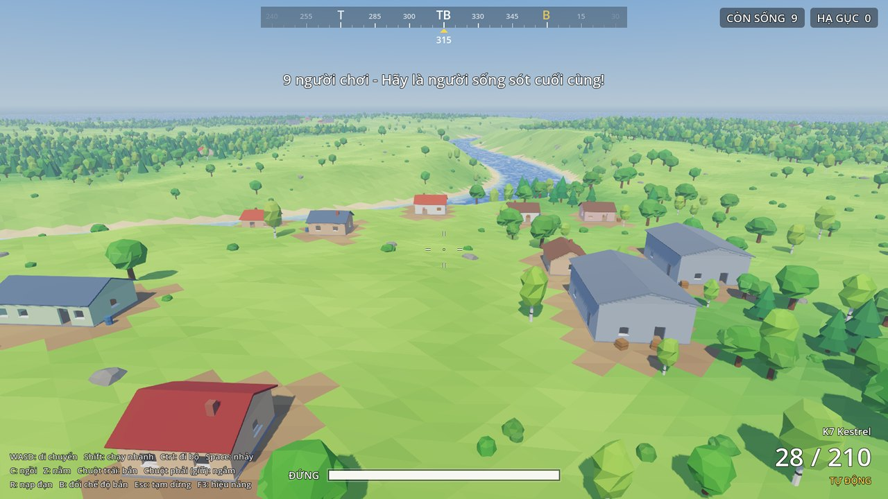
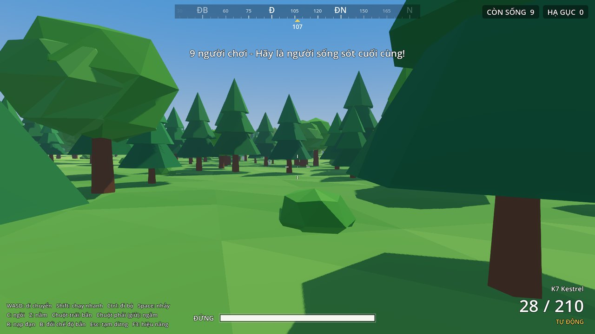
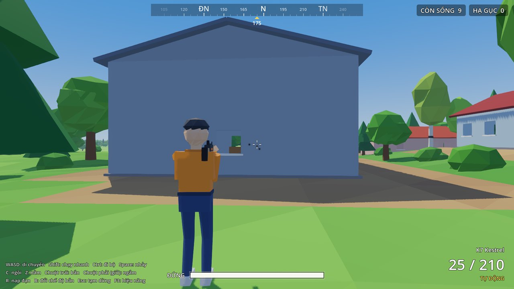
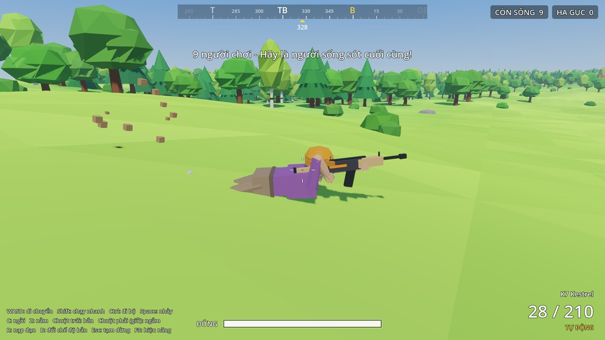
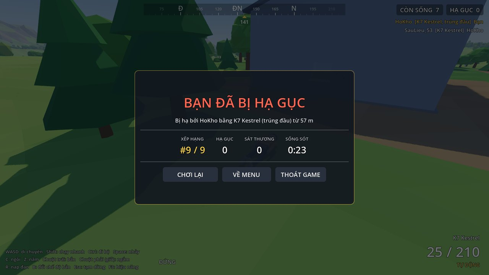
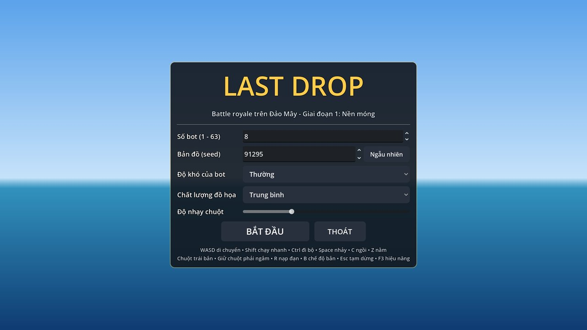
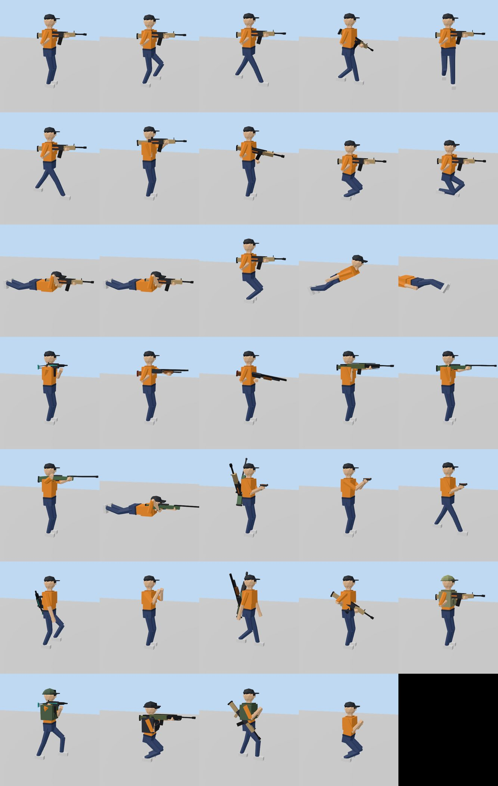

# LAST DROP – Battle royale low-poly (Godot 4.7)

Game battle royale 3D góc nhìn thứ ba, phong cách low-poly hoạt hình, lấy cảm hứng từ lối chơi
PUBG nhưng **toàn bộ tên, hình ảnh và thiết kế đều tự làm**. Mọi thứ (địa hình, cây, nhà, nhân vật,
súng, âm thanh) đều được **sinh bằng code** trong Godot. Không dùng model, texture hay file âm thanh
bên ngoài.

> Trạng thái: **Giai đoạn 1/4 – Nền móng** (xong) · **Giai đoạn 2 – Vòng lặp battle royale** (đang làm, xem mục 3b).
> Bản đồ: *Đảo Mây* (sinh theo seed) · 6 khẩu súng · Engine: Godot **4.7.2 Standard (GDScript)**



| | |
|---|---|
|  |  |
|  |  |
|  |  |

Các tư thế hoạt họa (sinh hoàn toàn bằng code):


---

## 1. Cách mở dự án

1. Tải **Godot 4.7.2 Standard** (bản thường, *không* phải .NET): <https://godotengine.org/download/archive/4.7.2-stable/>
2. Mở Godot → **Project Manager** → **Import** → chọn file `project.godot` trong thư mục này →
   **Import & Edit**.
3. Lần mở đầu tiên Godot sẽ import dự án (vài giây).
4. Nhấn **F5** (Run Project) để vào menu chính, chọn số bot / seed bản đồ, rồi bấm **BẮT ĐẦU**.
   - Mỗi lần vào trận, đảo được sinh lại theo seed. Máy tầm trung mất khoảng **4 giây** (có màn hình loading).
   - Muốn vào thẳng trận (bỏ qua menu): mở `scenes/game/game.tscn` rồi nhấn **F6**.

Renderer: **Forward+** (Vulkan / D3D12 / Metal). Card đồ họa rất cũ không có Vulkan thì đổi sang
*Compatibility* trong `Project Settings > Rendering > Renderer`. Chế độ đó chưa được tối ưu cho game này.

## 2. Điều khiển

| Phím | Hành động |
|---|---|
| **W A S D** | Di chuyển |
| **Shift** (giữ) | Chạy nhanh (chỉ khi đi tới, không ngắm / bắn) |
| **Ctrl** (giữ) | Đi bộ chậm |
| **Space** | Nhảy (khi đang ngồi / nằm thì đứng dậy). Trên máy bay: nhảy dù; khi rơi tự do: mở dù |
| **C** | Ngồi / đứng |
| **Z** | Nằm / đứng |
| **Chuột** | Xoay camera |
| **Chuột trái** | Bắn |
| **Chuột phải** (giữ) | Ngắm (zoom qua vai; nếu súng có ống ngắm thì nhìn qua ống ngắm, góc nhìn thứ nhất) |
| **Shift** khi đang ngắm qua ống | Nín thở: giảm rung tay trong khoảng 5 giây |
| **R** | Nạp đạn (bắn khi hết đạn cũng tự nạp) |
| **B** | Đổi chế độ bắn: tự động / phát một |
| **1 / 2 / 3** | Cầm súng chính 1 / súng chính 2 / súng lục |
| **Lăn chuột** | Đổi sang súng kế tiếp / trước đó |
| **X** | Cất súng (tay không, chuột trái để đấm) |
| **F** | Nhặt món đồ đang nhìn vào (có dòng nhắc ở giữa màn hình). Trên máy bay: nhảy; khi rơi: mở dù |
| **Tab** | Mở / đóng túi đồ (nhặt, bỏ, dùng đồ, cầm súng bằng chuột) |
| **M** | Mở / đóng bản đồ lớn |
| **G** / **T** (giữ, rồi thả) | Rút chốt lựu đạn / bom khói, hiện đường bay, thả tay để ném |
| **H** | Hồi máu nhanh (tự chọn băng gạc / sơ cứu / hộp y tế hợp với lượng máu) |
| **4 / 5 / 6 / 7 / 8** | Băng gạc / Bộ sơ cứu / Hộp y tế / Nước tăng lực / Thuốc giảm đau (bấm lại để hủy) |
| **Esc** | Tạm dừng (chỉnh độ nhạy chuột, đồ họa, về menu) |
| **F3** | Bật / tắt bảng hiệu năng (FPS, draw call, tam giác, thời gian vật lý) |

Có thể đổi phím trong `Project Settings > Input Map` (hoặc sửa `tools/setup_input.gd` rồi chạy lại).

## 3. Những gì đã làm được (Giai đoạn 1)

**Bản đồ (sinh bằng thuật toán)**
- Đảo khoảng 2 × 2 km (lưới độ cao 513 × 513, ô 4 m). Có đồi thoai thoải, 2–3 khối núi có sống núi,
  đồng cỏ phẳng, bãi cát, một **con sông** uốn khúc cắt ngang đảo và 1–2 **hồ**. Biển bao quanh,
  có tường vô hình ở mép bản đồ.
- Khoảng 6 làng và vài trang trại (khoảng 50–60 căn nhà với seed 1337): nhà nhỏ, nhà dài 2 phòng,
  nhà kho, lán. Có **cửa ra vào và cửa sổ để đi vào / bắn qua**, mái, ống khói, bàn giường, thùng
  gỗ, thùng phuy làm vật che chắn. Nền nhà được san phẳng tự động.
- Khoảng 18 000 cây (thông, sồi, bạch dương), 6 000 bụi, 900 tảng đá, dùng **MultiMesh** chia ô
  128 m và 2 mức LOD, có gió lay trong shader. Thân cây và đá có va chạm (chắn đạn), nhưng không tạo
  node cho từng cây.
- Nước hoạt hình: màu theo độ sâu, bọt ở bờ, gợn sóng. Có thể **lội và bơi**.
- Cùng một seed luôn cho ra cùng một hòn đảo (xem `docs/screenshots/map_seed1337.jpg`).

**Nhân vật (dùng chung cho người chơi và bot)**
- Góc nhìn thứ ba qua vai. Hỗ trợ đi, chạy, chạy nhanh, nhảy, ngồi, nằm, bơi. Camera có
  spring-arm nên không xuyên tường.
- Nhân vật low-poly là **1 mesh skinned duy nhất** (1 draw call). Hoạt họa thủ tục: chu kỳ bước
  chân, chuyển tư thế mượt, **IK hai khớp** giữ tay luôn trên súng và chân chạm đất, động tác nạp
  đạn, chạy nhanh bế súng chéo, ngã khi chết.
- Mỗi bot mặc quần áo, màu da, mũ ngẫu nhiên.

**Bắn súng**
- Súng trường *K7 Kestrel* với thông số trong `resources/weapons/k7_rifle.tres`:
  - Sát thương 36. Nhân hệ số theo bộ phận: **đầu ×2.2**, **thân ×1.0**, **tay/chân ×0.75**.
  - Băng đạn 30, tốc độ bắn 660 phát/phút, nạp đạn 2.3 giây.
- Đạn bay có vận tốc 850 m/s và rơi theo trọng lực. Sát thương giảm theo khoảng cách. Có vệt đạn
  (tracer) và âm thanh khi đạn sượt qua người chơi.
- Súng giật tích lũy dần: người chơi phải ghì chuột xuống khi xả đạn. Độ tỏa đạn nở ra khi bắn
  liên tục, khi di chuyển hoặc nhảy, và thu hẹp khi ngắm, ngồi hoặc nằm. Tâm ngắm co giãn theo
  đúng độ tỏa này.
- Hitbox dạng capsule bám theo xương: đầu, thân, tay, chân (nằm xuống thì hitbox cũng nằm theo).
- Hiệu ứng trúng đích: bụi đất, dăm gỗ, đá vụn, vụn tường, "máu" hoạt hình, bọt nước; lỗ đạn trên
  tường; hit marker (trắng thường, vàng khi trúng đầu, đỏ khi hạ gục) và âm thanh riêng.

**Bot (AI máy trạng thái)**
- `BotBrain` gồm 4 phần:
  - **Perception**: tầm nhìn có góc nhìn và kiểm tra tầm nhìn thẳng. Kẻ địch đang ngồi hoặc nằm
    khó bị phát hiện hơn. Bot nghe được tiếng súng.
  - **StateMachine**: các trạng thái Idle → Wander → Investigate → Combat.
  - **Navigator**: né cây, tường, nước và tự gỡ kẹt.
  - **Aim**: có thời gian phản xạ, sai số ngắm giảm dần khi bám mục tiêu, tự ghì súng giật, bắn
    theo loạt.
- Khi giao chiến, bot biết chạy ngang, lùi, áp sát, ngồi hoặc nằm bắn, nạp đạn, và đuổi theo vị trí
  cuối cùng nhìn thấy mục tiêu.
- Ba mức độ khó. Bot đánh cả nhau theo luật battle royale. Số bot chọn từ 1 đến 63 (mặc định 8).

**HUD và luồng trận**
- Thanh máu (có vệt máu vừa mất), đạn trong băng / đạn dự trữ, chế độ bắn, tư thế, tâm ngắm động.
- La bàn tiếng Việt (B, Đ, N, T), số người còn sống, số kẻ bị hạ, bảng hạ gục (kill feed), chỉ báo
  hướng bị bắn, viền đỏ khi trúng đạn.
- Màn hình chết / chiến thắng: hạng, số kẻ bị hạ, sát thương gây ra, thời gian sống sót, ai hạ bạn,
  bằng súng gì, có trúng đầu không, từ bao xa. Có nút **CHƠI LẠI**: đấu lại ngay trên cùng hòn đảo,
  không phải sinh lại bản đồ. Ngoài ra có menu chính, menu tạm dừng và màn hình loading.
- Toàn bộ âm thanh được tổng hợp bằng code: tiếng súng (xa thì bị lọc trầm), nạp đạn, trúng đích,
  bước chân, đạn sượt qua.

## 3b. Giai đoạn 2 – Vòng lặp battle royale (đang làm)

Mỗi mục dưới đây được commit riêng khi đã chạy được và qua `tools/check_project.sh`.

**2.1 Nhiều súng và ô vũ khí** ✔
- 6 khẩu súng (thông số trong `resources/weapons/*.tres`, model sinh bằng code trong `WeaponModels`):

  | Súng | Loại | Đạn | Sát thương | Tốc độ bắn | Băng | Ghi chú |
  |---|---|---|---|---|---|---|
  | K7 Kestrel | Súng trường | 5.8 mm | 36 | 660/phút | 30 | tự động / phát một |
  | V9 Vespa | Tiểu liên | 9 mm | 26 | 860/phút | 32 | bắn từ hông tốt, đạn chậm, giảm sát thương nhanh theo khoảng cách |
  | B12 Bison | Súng săn (bơm) | 12G | 9 × 19 | 65/phút | 5 | 9 viên chì, nạp từng viên (bóp cò để ngắt nạp) |
  | D3 Heron | Súng trường bắn tỉa | 7.6 mm | 54 | phát một | 10 | chính xác khi ngắm, giật mạnh |
  | R8 Raven | Súng bắn tỉa (khóa nòng) | 7.6 mm | 92 (đầu ×2.6) | 45/phút | 5 | kéo khóa nòng sau mỗi phát |
  | P1 Sparrow | Súng lục | 9 mm | 30 | phát một | 15 | cầm hai tay, rút nhanh |
- Mỗi nhân vật có **2 ô súng chính + 1 ô súng lục**, và luôn có **tay không** (đấm 14 sát thương, tầm 1.9 m).
  Đổi súng mất 0.55 giây (súng hạ xuống rồi nâng lên, không bắn được trong lúc đổi). Súng chính không cầm
  trên tay được đeo chéo sau lưng.
- Tiếng súng riêng cho từng loại. Tâm ngắm của súng săn là vòng tròn đúng bằng vùng tỏa chì.
- Bot chọn súng hợp với khoảng cách (súng săn / tiểu liên thì áp sát, bắn tỉa thì giữ khoảng cách, đổi
  sang súng lục khi địch quá gần), bắn phát một đúng nhịp với súng không tự động.

**2.2 Loot, nhặt đồ, túi đồ** ✔
- Mỗi trận, khoảng 80% điểm loot trong nhà (≈190 điểm với seed 1337) được rải đồ ngẫu nhiên: súng (nằm
  trên sàn, băng đạn rỗng, kèm 1–2 hộp đạn đúng loại), hộp đạn, balo cấp 1–3. Khoảng 250–300 món mỗi trận.
- Đồ nằm đất là dữ liệu + 1 mesh đơn giản, chỉ hiện trong 85 m; có lưới không gian để tìm đồ gần.
- **F** nhặt món đang nhìn vào (không nhặt xuyên tường). Nhặt súng khi đã đủ 2 súng chính thì súng đang
  cầm được đổi ra đất (giữ nguyên số đạn trong băng).
- **Túi đồ theo sức chứa**: không balo 80, balo cấp 1/2/3 thêm 100/150/200. Đạn có trọng lượng (5.8 mm 0.5,
  9 mm 0.4, 12G 1.25, 7.6 mm 1.0). Túi đầy thì chỉ nhặt được một phần.
- **Tab** mở màn hình túi đồ: cột *Mặt đất* (đồ trong 3 m), *Balo* (thanh sức chứa, bỏ đồ), *Trang bị*
  (3 ô súng, cầm / bỏ súng, bỏ balo).
- Khi chết, mọi thứ rơi ra quanh xác để người khác nhặt.
- Người chơi bắt đầu chỉ với súng lục P1 + 30 viên và phải tự đi nhặt.

**2.3 Giáp, mũ, hồi máu, tăng lực** ✔
- **Mũ** (giảm sát thương vào đầu) và **áo giáp** (giảm sát thương vào thân và sát thương nổ), mỗi loại 3 cấp:
  giảm 30% / 40% / 55%. Giáp mòn dần theo sát thương hứng chịu; mũ / giáp hết độ bền thì vỡ (có thông báo).
  Tay chân không được bảo vệ. Mũ và giáp hiện trên người nhân vật (1 mesh mỗi món, bám theo xương).
- Đồ hồi máu (dùng mất vài giây, chỉ đi bộ được, bắn / ngắm / chạy nhanh / nạp đạn / đổi súng thì bị hủy):

  | Đồ | Tác dụng | Thời gian |
  |---|---|---|
  | Băng gạc | +10 máu, tối đa 75 | 4 giây |
  | Bộ sơ cứu | hồi lên 75 | 6 giây |
  | Hộp y tế | hồi đầy 100 | 8 giây |
  | Nước tăng lực | +40 boost | 4 giây |
  | Thuốc giảm đau | +60 boost | 6 giây |
- **Thanh boost** (4 đoạn màu cam trên thanh máu) giảm dần 0.6/giây; khi còn boost thì hồi máu liên tục
  (nhanh hơn khi boost cao), trên 60 thì chạy nhanh hơn 6%. Thanh máu có vạch 75 (giới hạn của băng gạc / sơ cứu).
- HUD: ô Mũ / Giáp / Balo cạnh thanh máu (cấp + độ bền), vòng tiến độ khi đang dùng đồ.
- Tỉ lệ đồ trong nhà: súng 26, đạn 26, hồi máu 17, mũ 7, giáp 7, tăng lực 7, balo 6. Bot tạm thời xuất phát
  với giáp / mũ cấp 1–2 ngẫu nhiên (rơi ra khi chết).

**2.4 Bo thu hẹp, minimap, bản đồ** ✔
- 7 pha bo. Mỗi pha: vòng tiếp theo (trắng) được công bố, chờ, rồi vòng hiện tại (xanh) thu nhỏ dần về vòng
  trắng. Vòng mới luôn nằm trọn trong vòng cũ và ưu tiên tâm trên đất liền.

  | Pha | Chờ | Thu hẹp | Bán kính còn lại | Sát thương ngoài bo |
  |---|---|---|---|---|
  | 1 | 90 s | 60 s | 600 m | 0.6/s |
  | 2 | 60 s | 45 s | 360 m | 1/s |
  | 3 | 50 s | 40 s | 200 m | 2/s |
  | 4 | 40 s | 30 s | 110 m | 3.5/s |
  | 5 | 30 s | 25 s | 55 m | 5/s |
  | 6 | 25 s | 20 s | 25 m | 7/s |
  | 7 | 20 s | 20 s | 0 m | 10/s |
- Sát thương bo xuyên giáp, trừ mỗi giây. Kill feed / màn hình chết ghi "gục trong vùng độc".
- Tường bo: một hình trụ khổng lồ trong suốt màu xanh có sọc chạy (shader `zone_wall.gdshader`), mờ dần lên cao.
  Đứng ngoài bo thì màn hình ám xanh.
- Menu chính có tùy chọn **nhịp bo**: bình thường (~9 phút), nhanh (~6 phút), rất nhanh (~3 phút).
- **Minimap** góc trái dưới (bắc ở trên, khoảng 520 m): địa hình, vòng xanh / trắng, đường chấm tới vùng an
  toàn khi đang ở ngoài, mũi tên hướng nhìn. Phía trên minimap: pha, thời gian đếm ngược, khoảng cách tới bo.
- **Bản đồ lớn (M)**: toàn đảo, lưới A–H / 1–8, tên các làng, vòng bo. Ảnh bản đồ vẽ một lần lúc loading
  (512 × 512, khoảng 0.8 giây).
- Bot có trạng thái mới **Zone**: tự chạy vào vòng trắng khi đang ngoài bo hoặc khi thời gian còn lại trước lúc
  bo bắt đầu thu không đủ để đi bộ vào (mỗi bot có độ "cẩn thận" riêng); đi lang thang thì ưu tiên điểm trong bo.

**2.5 Máy bay và nhảy dù** ✔
- Mọi người (cả bot) bắt đầu trên **máy bay** bay thẳng qua đảo ở độ cao 480 m, 65 m/s, hướng và vị trí ngẫu
  nhiên mỗi trận. Máy bay low-poly 4 động cơ (cánh quạt quay, tiếng động cơ tổng hợp). Đường bay hiện trên
  minimap / bản đồ (nét đứt vàng + biểu tượng máy bay).
- Cửa mở khi máy bay vào trên đảo; ai còn trên máy bay lúc nó rời đảo sẽ bị đẩy ra. Trên máy bay không bị bo,
  không bị nhìn thấy / bắn trúng. Camera lùi xa để nhìn máy bay.
- **Rơi tự do**: 42 m/s (nhìn xuống + W để lao nhanh tới 60 m/s), bay ngang tới 32 m/s. Dù tự mở ở 110 m
  trên mặt đất, hoặc bấm F / Space để mở sớm và lượn xa hơn. Có tiếng gió theo tốc độ.
- **Dù**: lượn 16 m/s, rơi 6.5 m/s; W lượn nhanh và xuống nhanh hơn, S giảm tốc, chuột đổi hướng. Tán dù
  sinh bằng code (màu theo áo). Chạm đất / mặt nước là đáp xuống.
- Vòng bo đầu tiên xuất hiện khi máy bay bay hết đường.
- **Bot**: trạng thái mới **Parachute**: chọn chỗ đáp cạnh một ngôi nhà (ưu tiên làng) trong khoảng 520 m từ
  đường bay (thỉnh thoảng chọn chỗ vắng), tính thời điểm nhảy, lao / mở dù sớm tùy khoảng cách, đáp trúng chỗ
  chọn (sai lệch trung vị vài mét).
- Dòng nhắc giữa màn hình: số người còn trên máy bay, độ cao, phím mở dù.

**2.6 Ống ngắm** ✔
- 4 loại: **chấm đỏ** (×1.3), **2x**, **4x**, **8x** (model sinh bằng code, gắn lên ray súng, nằm được trên đất).
  Súng lục và súng săn chỉ gắn được chấm đỏ; tiểu liên tới 4x; súng trường / DMR / bắn tỉa gắn được tất cả.
- Nhặt ống ngắm: tự gắn lên súng đang cầm (hoặc súng khác) nếu súng đó chưa có ống; nếu không thì vào balo
  (nặng 5). Trong túi đồ: nút **Gắn 1/2/3** và **Tháo ống**. Súng rơi ra đất vẫn giữ nguyên ống ngắm.
- **Ngắm qua ống** (chuột phải khi súng có ống): camera chuyển vào mắt nhân vật (góc nhìn thứ nhất), FOV theo
  độ phóng đại, ẩn thân mình; chấm đỏ chỉ có chấm + vành; 2x trở lên có mặt nạ đen tròn, lưới ngắm duplex
  (4x, 8x có chấm mil để ước lượng đạn rơi).
- **Rung tay** tỉ lệ với độ phóng đại, giảm khi ngồi / nằm, tăng khi di chuyển. **Shift** để nín thở (5 giây,
  hồi dần), hết hơi thì rung mạnh hơn. Độ nhạy chuột tự giảm theo FOV.
- HUD hiện ống ngắm trong danh sách súng ("K7 Kestrel [4x]"). Tỉ lệ loot: ống ngắm 8% các điểm
  (chấm đỏ 40, 2x 30, 4x 20, 8x 10).
- Bot mang DMR / súng bắn tỉa có sẵn 4x hoặc 8x, 40% bot súng trường có ống; ống ngắm giúp bot bắn chính xác
  hơn ở xa (sai số ×0.75 khi > 60 m).

**2.7 Lựu đạn và bom khói** ✔
- **Lựu đạn** (nặng 12) và **bom khói** (nặng 10) là đồ trong balo; loot 7% các điểm (lựu đạn 60, khói 40).
- **Giữ G / T**: rút chốt, hiện đường bay dự đoán (vạch vàng, tính cả nảy tường / đất), tay phải vung ra sau với
  quả lựu đạn trong tay. **Thả phím** để ném (19 m/s, hơi bổng). Ngòi lựu đạn 4.5 giây tính từ lúc rút chốt, có
  đếm ngược ở tâm màn hình; giữ quá lâu thì nổ ngay trên tay.
- Vật ném bay theo đạn đạo, nảy trên tường / đất (mất năng lượng mỗi lần nảy), chìm khi rơi xuống nước.
- **Nổ**: sát thương tới 115 trong bán kính 8 m (giảm dần theo khoảng cách), tường / địa hình che chắn được,
  áo giáp giảm sát thương nổ. Có chớp sáng, tia lửa, khói đen, tiếng nổ tổng hợp, rung camera khi ở gần. Bot
  "nghe" được tiếng nổ. Người ném được tính điểm hạ gục.
- **Bom khói**: bung khói sau 2.2 giây, đám khói lớn dần tới bán kính 7 m, tồn tại 32 giây rồi tan. Khói
  **chặn tầm nhìn của bot** (bot không thấy mục tiêu nằm sau / trong khói).
- HUD: số lựu đạn / bom khói dưới danh sách súng. Bot tạm thời vẫn xuất phát với một
  súng chính ngẫu nhiên và đạn không giới hạn (bot biết nhặt đồ ở giai đoạn 3); khi chết bot rơi súng và
  vài hộp đạn.

## 3c. Giai đoạn 3 – Bot thông minh hơn (đang làm)

**3.1 Bot tự nhặt đồ** ✔
- Bot (và người chơi) giờ **xuất phát tay không**, nhảy dù xuống và phải tự nhặt đồ. (Tùy chọn
  `MatchConfig.starting_kits` vẫn còn cho các bài kiểm tra.)
- **Vào nhà qua cửa**: khi dựng nhà, vị trí từng cửa (và cửa thông phòng trong nhà dài) được ghi lại;
  `Settlements.plan_path()` tạo các điểm đi qua cửa để ra / vào nhà, `BotNavigator` đi theo các điểm này
  (tắt né vật cản khi đang qua khung cửa). Bot ở gần nhà luôn dùng vật lý đầy đủ (không dùng LOD đơn giản).
- `BotLoot` chấm điểm món đồ theo nhu cầu: chưa có súng thì súng nào cũng quý; đạn chỉ nhặt khi hợp súng đang
  mang; giáp / mũ khi tốt hơn; balo khi cấp cao hơn; đồ hồi máu / lựu đạn tới một số lượng nhất định; ống ngắm
  khi có súng gắn được. Điểm chia theo khoảng cách.
- Trạng thái mới:
  - **Loot**: đi tới món đáng giá nhất trong 32 m, nhặt, lặp lại tới khi hết đồ đáng nhặt hoặc hết thời gian.
  - **Search**: còn thiếu đồ (chưa có súng dùng được, ít đạn, thiếu giáp / mũ, ít đồ hồi máu) thì tới ngôi nhà
    gần nhất chưa lục trong bo rồi lục nhà đó.
- Sau khi đáp dù, sau khi hạ địch (nhặt đồ rơi ra), khi rảnh, và dọc đường đi (đồ tốt trong 16–18 m) bot đều
  nhặt đồ. Bot giữ súng tốt nhất trên tay và tự nạp đạn khi rảnh.
- **Bot tay không**: không lao vào đấu súng; bị áp sát (< 7 m) hoặc bị đánh thì đấm lại, còn không thì tiếp tục
  đi tìm súng; bỏ qua tiếng súng xa.
- Bo: bot tính lúc nào cần đi vào vòng mới dựa vào thời gian **vòng đóng hẳn** và quãng đường, cộng thêm một
  khoảng an toàn tăng dần theo pha; khi còn dư thời gian thì vừa đi vừa nhặt đồ.

**3.2 Bot hồi máu, dùng thuốc tăng lực, bom khói che chắn** ✔
- Trạng thái mới **Heal**: khi không giao chiến và máu < 75 (hoặc boost thấp mà có nước tăng lực / thuốc giảm
  đau), bot ngồi xuống, nhìn quanh và dùng lần lượt đồ hồi máu hợp lý (cùng luật với người chơi: băng gạc / sơ
  cứu tới 75, hộp y tế khi máu rất thấp) rồi tới đồ tăng lực. Không hồi máu khi đang ở ngoài bo mà bo sắp đóng.
- Đang giao chiến mà máu < 40: nếu địch đã mất dấu mình > 2 giây thì hồi máu ngay; nếu máu < 30 và có bom khói
  thì **ném khói về phía địch** rồi hồi máu sau màn khói (khói chặn tầm nhìn của bot địch).
- Bot ném lựu đạn / khói có ngắm: thử các góc ném bằng quỹ đạo dự đoán của `ThrowableSystem` (cùng bước thời
  gian với vật lý, tính cả nảy, lấy vị trí lúc ngòi nổ), tinh chỉnh quanh góc tốt nhất, đứng yên, quay người rồi
  thả tay đúng góc đã tính (sai số thường 3–7 m ở 14 m).

**3.3 Chiến thuật giao tranh** ✔
- **Nấp**: giữa trận ở tầm trung (hoặc khi bị bắn mà không thấy kẻ bắn), bot tìm chỗ nấp gần (thử 12 điểm quanh
  mình, chọn điểm bị tường / cây / đá / địa hình che ở độ cao khi ngồi, không lùi xa địch quá), chạy tới, ngồi
  xuống (nạp đạn), rồi **đứng lên bắn vài giây và lại nấp**.
- **Lựu đạn**: địch vừa nấp mất dấu (1.2–6 giây), cách 7–34 m, bot có lựu đạn thì ném vào vị trí cuối cùng thấy
  địch (thời gian hồi 10 giây).
- **Bo đang đóng**: bot bỏ trận đánh khi mất dấu địch (hoặc địch ở xa) để chạy vào bo, và trên đường chạy thì bỏ
  qua địch ở xa nếu không bị bắn.
- Độ khó ảnh hưởng chiến thuật: tỉ lệ tìm chỗ nấp 25% / 55% / 80%, dùng lựu đạn 20% / 60% / 90% (Dễ / Thường /
  Khó).

**3.4 Nhảy dù tản ra, nhặt đồ trên đường vào bo** ✔
- Chọn chỗ đáp: nhà kho / nhà dài hấp dẫn hơn, gần đường bay hơn thì tốt hơn (tới 650 m), và **tránh chỗ bot khác
  đã chọn** (trọng số chia cho 1 + 1.5·n²). 15% bot "thích đánh sớm" lại cố tình đáp vào chỗ đông.
- Bo pha 1–2 (sát thương thấp): bot còn thiếu đồ mà phải di chuyển thì **lục một ngôi nhà nằm trên đường vào bo**
  thay vì chạy thẳng. Chạy vào bo đường xa thì chạy nhanh (tính thời gian theo tốc độ chạy nhanh).
- Bot tay không khi đã hết nhà để lục: đi tìm súng rơi từ xác chết trong bo (bán kính 260 m).

**3.5 Hiệu năng cho 63 bot** ✔
- Mức chi tiết mô phỏng theo khoảng cách tới camera: bot < 70 m (hoặc vừa bắn) chạy vật lý mỗi tick; 70–160 m mỗi
  2 tick; xa hơn mỗi 3 tick (dồn delta, hình ảnh vẫn nội suy mượt); bot xa hơn 230 m ngoài nhà dùng di chuyển bám
  địa hình, cũng mỗi 3 tick. Bộ não bot vẫn giảm tần suất như giai đoạn 1.
- Bộ đo `Prof` (chỉ bật trong mô phỏng) in thời gian từng phần mỗi tick vật lý: `--matchsim=... --follow` cho camera
  bám theo một bot còn sống để đo giống người chơi thật.

## 4. Kiến trúc

```
Main (scenes/main)  ── MainMenu, LoadingScreen
 └─ GameSession (scenes/game/game.tscn)         đăng ký dịch vụ vào autoload `Game`
     ├─ WorldEnvironment, Sun
     ├─ GameWorld        HeightMap → Settlements → TerrainBuilder → Vegetation → nước
     ├─ Characters       các GameCharacter (Player.tscn / Bot.tscn)
     ├─ ProjectileSystem đạn dạng dữ liệu + tracer MultiMesh
     ├─ ThrowableSystem  lựu đạn / bom khói (đạn đạo, nổ, khói chặn tầm nhìn)
     ├─ FxManager        pool hiệu ứng / decal
     ├─ LootManager      đồ nằm đất, luật nhặt / bỏ / rơi đồ khi chết
     ├─ ZoneManager      bo: các pha, tường bo, sát thương ngoài bo
     ├─ MatchManager     máy bay (AirPlane), đếm người sống, thắng/thua, chơi lại
     └─ HUD, InventoryScreen, EndScreen, PauseMenu

Autoload: Events (signal bus) · Game (service locator) · Settings (lưu cấu hình) · Sfx (âm thanh)
```

**Ý tưởng chính: một thân, nhiều bộ não.** `GameCharacter` chỉ biết *cách* di chuyển và bắn. Việc
*làm gì* do một controller ghi vào các biến "ý định": `input_move`, `aim_yaw`, `input_fire`...
Controller đó là `PlayerController` (bàn phím + chuột) hoặc `BotBrain` (AI). Vì vậy mọi tính năng
sau này (túi đồ, giáp, hồi máu, nhảy dù, lái xe) chỉ cần viết một lần là cả người lẫn bot dùng
được.

```
scenes/            main/ game/ characters/ ui/        (các scene .tscn)
scripts/
  autoload/        events, game, settings, sfx
  core/            game_session, match_manager, match_config, zone_manager, air_plane, layers,
                   mesh_builder, name_generator
  world/           game_world, height_map, terrain_builder, settlements, vegetation
  characters/      game_character, character_model, character_hitboxes, player_controller,
                   third_person_camera, inventory
  items/           item_db (danh mục đồ), item_models, loot_manager (đồ nằm đất + luật nhặt/bỏ)
  weapons/         weapon_data (Resource), weapon_db, weapon, projectile_system, throwable_system,
                   weapon_models, damage_info
  ai/              bot_brain, bot_perception, bot_navigator, bot_profile, state_machine, bot_state
  ai/states/       idle, wander, investigate, combat, zone, parachute, loot, search
  ai/bot_loot      chấm điểm đồ cho bot
  fx/  ui/  debug/ (automation cho test headless)
resources/         weapons/*.tres (6 súng + tay không), ui/theme.tres
shaders/           foliage, water, tracer, zone_wall
tools/             công cụ kiểm tra headless (xem mục 6)
```

**Điểm mở rộng đã chuẩn bị cho các giai đoạn sau**

| Giai đoạn | Chỗ gắn vào |
|---|---|
| 2 – Máy bay, nhảy dù, bo, loot | `MatchManager.State` (thêm `PLANE`/`DROPPING`), `GameWorld.get_loot_points()` (đã có sẵn điểm loot trong mỗi nhà), `Inventory`, `GameCharacter._modify_incoming_damage()` (giáp/mũ) |
| 2 – Nhiều súng, ống ngắm, lựu đạn, bom khói | Thêm file `WeaponData` .tres + model trong `WeaponModels`; `DamageInfo` dùng chung cho nổ / bo |
| 3 – 63 bot thông minh hơn | Thêm `BotState` mới (Loot, Heal, MoveToZone, Parachute...) vào `BotBrain._build_states()`. Đã có sẵn LOD cho AI và vật lý (xem mục 5) |
| 4 – Tối ưu | Map dạng chunk, LOD sẵn có; `make_map_image()` dùng cho bản đồ nhỏ; lớp vật lý `VEHICLES`, `ITEMS` đã khai báo |

## 5. Hiệu năng (thiết kế cho máy tầm trung)

- **Forward+**, tắt các hiệu ứng đắt (SDFGI, SSR, volumetric fog). Bóng đổ từ mặt trời dùng 2 split,
  xa 120 m. Có 3 mức đồ họa trong menu:
  - **Thấp**: render scale 0.77 (upscale bằng FSR), bóng gần, tầm nhìn cây ×0.65.
  - **Trung bình**: FXAA.
  - **Cao**: SMAA, SSAO, bóng 4 split, tầm nhìn ×1.35.
- **Địa hình**: 256 chunk, 2 mức LOD chuyển bằng `visibility_range` (không tốn script mỗi frame). Có
  "váy" che khe hở giữa các chunk. Có occluder thô chìm dưới đất để cắt cây / nhà nằm sau đồi.
- **Va chạm**: dùng 1 `HeightMapShape3D` duy nhất cho cả đảo, chạy trên **Jolt Physics**. Tam giác
  của mesh hiển thị được chia **giống hệt** tam giác va chạm (đã kiểm chứng bằng raycast) nên chân
  không lún, không lơ lửng.
- **Cây**: MultiMesh theo ô, dựng bằng buffer thô. Va chạm tạo thẳng trên `PhysicsServer3D`
  (mỗi ô 1 body), không có node cho từng cây.
- **Nhân vật**: 1 draw call cho mỗi người. Hoạt họa cập nhật thưa dần theo khoảng cách hoặc khi
  ngoài màn hình. Hitbox là toán học thuần, không cần physics body cho từng bộ phận.
- **Đạn**: mô phỏng dạng dữ liệu. Có lưới không gian để mỗi viên chỉ kiểm tra nhân vật ở gần.
  Toàn bộ tracer vẽ bằng 1 MultiMesh. Hiệu ứng và decal dùng pool.
- **LOD cho mô phỏng**: bot ở xa camera (hơn 120 m / 300 m) chỉ "suy nghĩ" mỗi 2 / 4 tick vật lý.
  Bot xa hơn 230 m bỏ `move_and_slide` và chỉ bám theo mặt đất.

Số đo trên máy ảo dùng để phát triển (CPU cloud, **không có GPU thật**):

| Hạng mục | Kết quả |
|---|---|
| Sinh đảo (seed 1337) | khoảng 3.8–4.4 giây |
| Vẽ mỗi frame (cảnh thường, mức Trung bình) | khoảng 300–400 draw call, 200–290 nghìn tam giác |
| Bước vật lý + AI + đạn, 8 bot | khoảng 3–5 ms (tùy trận đánh) |
| Bước vật lý + AI + đạn, 63 bot (gần như tất cả đang đánh nhau) | khoảng 12 ms (sẽ tối ưu thêm ở giai đoạn 4) |
| Độ chính xác của bot mức Thường (bắn vào mục tiêu đứng yên) | 10 m: 43% · 25 m: 30% · 50 m: 18% · 100 m: 9% |

FPS trên card đồ họa thật **chưa đo được** vì máy ảo chỉ có renderer phần mềm. Xem mục 7.

## 6. Kiểm tra tự động (headless)

Tất cả chạy được mà không cần cửa sổ hay GPU:

```bash
GODOT=/đường/dẫn/Godot_v4.7.2-stable_linux.x86_64 tools/check_project.sh
```

Script này làm 4 bước:
1. Import dự án.
2. Load mọi script, scene, resource, shader (`tools/validate.tscn`).
3. Lấy lỗi và **cảnh báo** GDScript đúng như editor báo (`tools/lsp_diagnostics.py`). Kết quả hiện
   tại: **0 lỗi, 0 cảnh báo**.
4. Chạy thử một trận có autopilot (`--autotest`): bắn, đổi tư thế, bơi, tạm dừng, chơi lại, thua,
   thắng, về menu.

Các lệnh lẻ khác:

```bash
godot --headless --path . -- --autotest=40 --bots=8        # chạy thử trận
godot --headless --path . -- --duel=10,25,50,100 --bots=3  # đo độ chính xác của bot
godot --headless --path . -- --matchsim=600 --bots=24      # trận toàn bot: thống kê nhảy dù, bo, giao tranh
godot --headless --path . res://tools/worldgen_test.tscn -- 1337 map.png   # xuất bản đồ PNG theo seed
godot --path . -- --screenshots=out_dir                    # chụp màn hình các cảnh (cần GPU/xvfb)
godot --path . res://tools/pose_gallery.tscn -- poses.png  # ảnh tổng hợp các tư thế
```

## 7. Hạn chế đã biết (để dành cho các giai đoạn sau)

- Chưa có máy bay, nhảy dù, bo, loot, túi đồ, giáp, hồi máu. Người chơi bắt đầu ở một quảng trường
  làng với 30 + 210 viên đạn. Bot xuất hiện trong bán kính khoảng 380 m (bo tạm thời: bot có xu
  hướng đi về phía người chơi).
- Bot đi bằng lái hướng (steering), không dùng navmesh, nên đôi khi lúng túng ở góc nhà. Bot nhìn
  xuyên được tán cây / bụi (chỉ thân cây và tường chặn tầm nhìn).
- Nhà hiện chỉ có 1 tầng. Chưa có đường sá, cầu, xe cộ.
- Chưa có góc nhìn thứ nhất và chưa có ngắm qua ống ngắm (sẽ làm cùng hệ thống ống ngắm).
- Với 63 bot, CPU vẫn còn khá nặng (xem mục 5).

## 8. Những điểm cần bạn chơi thử và phản hồi

1. **Hiệu năng**: bấm **F3**, cho mình biết FPS, cấu hình máy (CPU/GPU) và mức đồ họa đang dùng. Nhờ
   thử thêm với 8, 20 và 63 bot. Máy có bị giật lúc mới vào trận (khi sinh đảo) không?
2. **Cảm giác điều khiển**: tốc độ đi / chạy / nhảy, độ nhạy chuột mặc định, khoảng cách camera,
   vị trí camera khi ngắm (chuột phải).
3. **Cảm giác bắn**: súng giật có quá nhẹ / quá nặng không, độ tỏa khi bắn từ hông, tâm ngắm có
   khớp với chỗ đạn trúng không, đạn rơi khi bắn xa có hợp lý không.
4. **Độ khó của bot**: mức Dễ / Thường / Khó có hợp lý không, bot có "bắn xuyên" hay nhìn thấy mình
   quá sớm không, có con nào đứng ngây ra hoặc kẹt ở đâu không.
5. **Bản đồ**: thử vài seed. Đảo có đẹp không? Mật độ cây (quá dày / quá thưa), kích thước núi,
   sông hồ, số làng và số nhà. Có chỗ nào nhân vật bị kẹt hay rơi xuyên đất không?
6. **Nhà**: có vào được mọi cửa không, có cửa sổ nào bắn qua bị lỗi không, trong nhà có bị tối quá
   không.
7. **Tư thế và hoạt họa**: ngồi, nằm, bơi, nạp đạn, ngã khi chết. Có tư thế nào trông kỳ không (đặc
   biệt khi chạy xuống dốc)?
8. **HUD / giao diện**: la bàn chữ Việt (B / Đ / N / T) có dễ đọc không, hay bạn muốn dùng N / E / S / W?
   Cỡ chữ, vị trí thanh máu và số đạn.
9. **Âm thanh**: âm thanh tổng hợp bằng code có chấp nhận được không, hay giai đoạn sau nên làm kỹ hơn?
10. **Phong cách hình ảnh**: màu sắc, ánh sáng, sương mù xa. Bạn muốn tươi hơn, ấm hơn hay dịu hơn?
